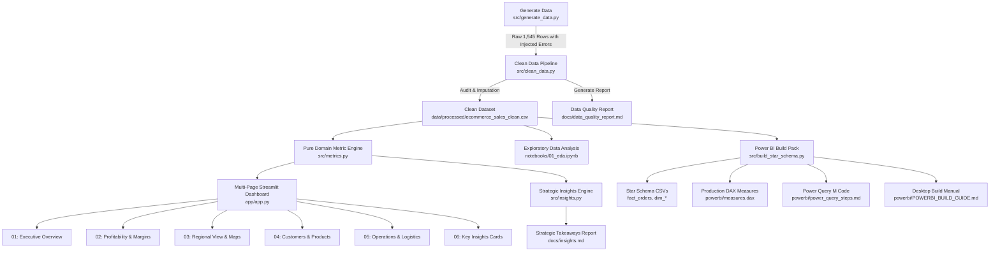
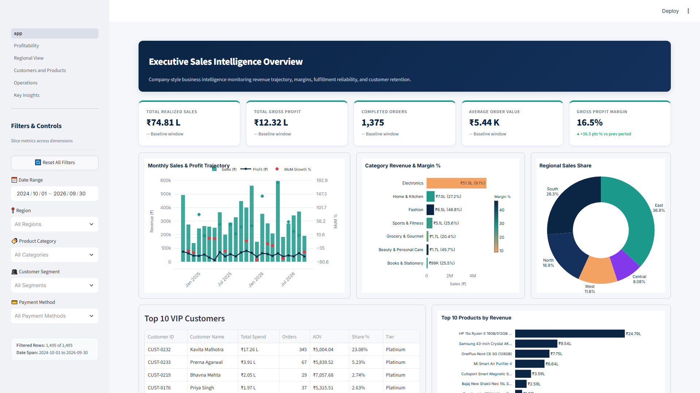
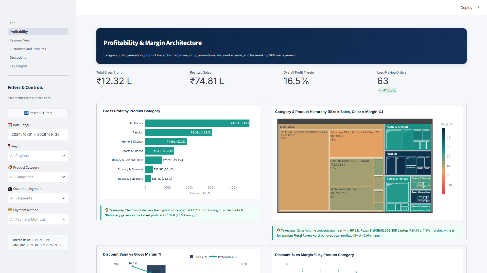
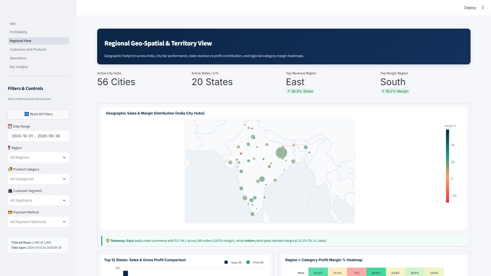
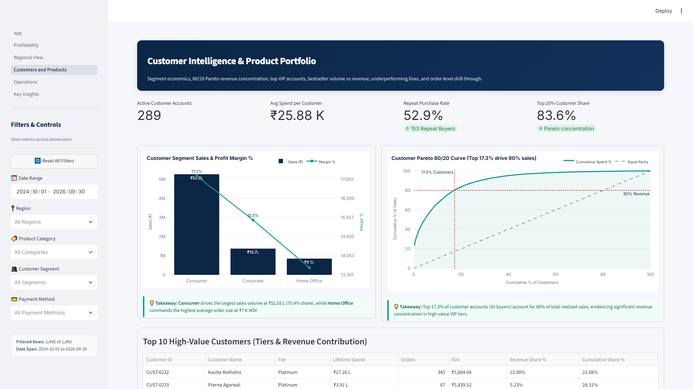
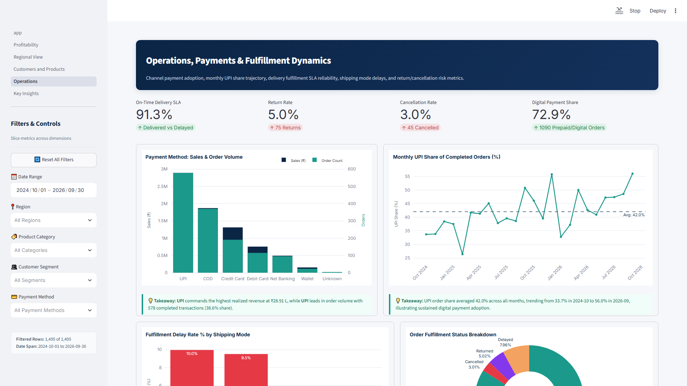
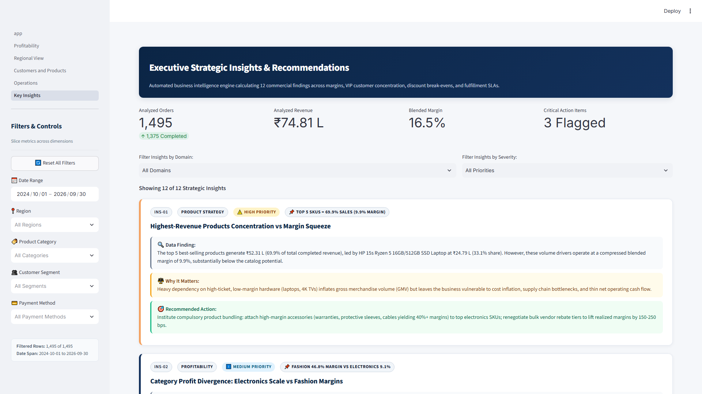

# 📊 E-Commerce Sales Insights & Executive BI Dashboard

[](https://www.python.org/)
[](https://streamlit.io/)
[](https://pandas.pydata.org/)
[](https://plotly.com/)
[](https://pytest.org/)
[-F2C811?style=for-the-badge&logo=powerbi&logoColor=black)](https://powerbi.microsoft.com/)
[](https://opensource.org/licenses/MIT)

> **Live Application**: [[LIVE APP URL]] | **Repository**: [[GITHUB URL]] | **Author**: [[YOUR NAME]] | **LinkedIn**: [[LINKEDIN URL]]

An enterprise-grade, full-stack Business Intelligence (BI) platform built for an Indian multi-channel e-commerce retailer. Engineered with an automated data quality audit and cleaning ETL pipeline, statistically rigorous metric engines, dynamic dark/light corporate theming, and 6 decision-support dashboards tracking **₹74.81 Lakhs in realized revenue across 1,495 transactions**.

---

## 📑 Table of Contents
- [Objective](#-objective)
- [Business Problem](#-business-problem)
- [Dataset Architecture & Dictionary](#-dataset-architecture--dictionary)
- [Project Directory Structure](#-project-directory-structure)
- [Methodology & Architecture](#-methodology--architecture)
- [Data Cleaning & Quality Audit Summary](#-data-cleaning--quality-audit-summary)
- [Analytics Performed](#-analytics-performed)
- [Metric Definitions & Accounting Logic](#-metric-definitions--accounting-logic)
- [Key Strategic Insights](#-key-strategic-insights)
- [Dashboard Features & Screenshots](#-dashboard-features--screenshots)
- [Power BI Build Pack](#-power-bi-build-pack)
- [Tech Stack](#-tech-stack)
- [How to Run Locally](#-how-to-run-locally)
- [Conclusion](#-conclusion)
- [Future Improvements](#-future-improvements)
- [Author & License](#-author--license)

---

## 🎯 Objective

The primary objective of this project is to develop an end-to-end, production-certified Business Intelligence (BI) and analytics platform that eliminates "dashboard delusion"—the common trap where e-commerce leadership celebrates surging top-line Gross Merchandise Value (GMV) while operating cash flows deteriorate under undisciplined promotional discounting, product return spikes, and fulfillment bottlenecks. By enforcing strict accounting boundaries (segregating realized revenue from operational friction), automating data quality audits with 100% relational integrity, and surfacing 12 algorithmic decision-intelligence recommendations, this platform empowers C-level executives (CEO, CFO, VP Sales) and functional leaders (Merchandising, Supply Chain) to optimize gross margins, protect bottom-line profit, and mitigate client concentration risks across India.

---

## 🏢 Business Problem

An omnichannel Indian e-commerce retailer operating across 5 geographic regions and 7 product categories experienced rapid volume expansion over a 24-month trading period (October 2024 to September 2026), generating ₹74.81 Lakhs in completed sales. However, executive management lacked unified visibility into critical commercial drivers across six operational pillars:

1. **Sales Trajectory & Seasonality**: Leadership could not isolate organic baseline demand from festive spikes, obscuring the fact that Q4 festive trading (Diwali in October/November) generated **23.1% of annual sales (₹17.3 Lakhs)**, leading to severe inventory stockouts in autumn followed by underutilized warehouse capacity in Q1.
2. **Profitability & Margin Dilution**: Aggressive promotional campaigns caused severe margin erosion. Management had no mechanism to detect the **20% promotional discount ceiling**, resulting in discounts $>20\%$ turning loss-making and bleeding **₹62.23 Thousand** in cumulative promotional losses (discounts $>30\%$ generated catastrophic **-29.7%** margin losses).
3. **Customer Concentration & Churn Vulnerability**: The business suffered from an extreme Pareto imbalance where **17.3% of customers (50 out of 289 accounts) generated 80.0% of total revenue (₹59.85 Lakhs)**. Losing fewer than 10 top Platinum accounts represented an existential threat to net cash flow. Furthermore, Corporate B2B accounts delivered a **+14.0% Average Order Value (AOV) premium (₹5,876.59 vs ₹5,161.66 for retail Consumers)**, but lacked dedicated B2B self-service portals.
4. **Product Portfolio Economics**: Merchandise strategy was heavily distorted by volume. The top 5 best-selling SKUs generated **69.9% of company revenue (₹52.31 Lakhs)**, led by the HP 15s Ryzen 5 Laptop at ₹24.79 Lakhs. However, these SKUs operated at a compressed **9.9% gross margin**. Meanwhile, high-margin categories like Fashion (46.8% margin) and Beauty & Personal Care (45.7% margin) collectively represented only **10.9% of sales**, receiving inadequate promotional capital.
5. **Regional Disparities**: Regional expansion was unguided by unit economics. The **South region delivered the highest gross margin at 18.0% (₹3.55 Lakhs profit on ₹19.67 Lakhs sales)**, while the **North region suffered a 4.9 percentage-point margin deficit at 13.2% (₹1.66 Lakhs profit on ₹12.63 Lakhs sales)** due to heavy discounting and logistics overhead.
6. **Logistics & Reverse Logistics Friction**: Customer fulfillment suffered from hidden supply chain friction. Standard shipping carried 52.7% of volume but incurred a **10.0% fulfillment delay rate (72 delayed orders)**. In reverse logistics, the **Fashion category suffered an alarming 16.9% return rate (45 returned orders out of 266)**—more than 3 times the catalog average (5.0%)—severely eroding realized apparel margins.

---

## 📊 Dataset Architecture & Dictionary

The project evaluates synthetic transactional data engineered to mirror real-world Indian multi-channel retail operations. The clean production dataset (`data/processed/ecommerce_sales_clean.csv`) contains **1,495 rows** and spans an exact 24-month trading window from **2024-10-01 to 2026-09-30**.

The schema consists of the **20 raw transactional columns** plus **10 derived analytical features** added during the automated data cleaning and feature engineering pipeline:

### Comprehensive Data Dictionary Table (30 Columns)

| # | Column Name | Data Type | Permissible Domain / Example | Nature | Business Description |
| :-: | :--- | :---: | :--- | :---: | :--- |
| **1** | `order_id` | `string` | `ORD-100001` to `ORD-101500` | Raw | Unique primary key for each customer order transaction. |
| **2** | `customer_id` | `string` | `CUST-0001` to `CUST-0289` | Raw | Unique identifier for registered customer accounts. |
| **3** | `customer_name` | `string` | e.g., `Aarav Sharma`, `Kavita Malhotra` | Raw | Full legal name of the purchasing customer. |
| **4** | `order_date` | `datetime64[ns]` | `2024-10-01` to `2026-09-30` | Raw | Date order was placed (parsed from ISO, slash, and text formats). |
| **5** | `region` | `string` | `North`, `South`, `East`, `West`, `Central` | Raw | Macro geographic administrative zone across India. |
| **6** | `state` | `string` | `Maharashtra`, `Karnataka`, `Delhi`, etc. | Raw | Indian State or Union Territory of delivery destination. |
| **7** | `city` | `string` | `Mumbai`, `Bengaluru`, `Kolkata`, `Jaipur`, etc. | Raw | Destination city (linked to latitude/longitude coordinates). |
| **8** | `product_category` | `string` | 7 Categories (Electronics, Fashion, etc.) | Raw | Primary retail merchandise departmental classification. |
| **9** | `product_name` | `string` | 28 SKUs (e.g., `HP 15s Ryzen 5 Laptop`) | Raw | Specific commercial product title / catalog item name. |
| **10** | `quantity_sold` | `int64` | `1` to `10` units | Raw | Number of physical units purchased in the order line item. |
| **11** | `unit_price` | `float64` | `₹149.00` to `₹45,999.00` | Raw | Catalog list price per unit prior to discount (INR). |
| **12** | `discount_percent` | `float64` | `0.0%` to `40.0%` | Raw | Promotional discount percentage applied at checkout. |
| **13** | `sales_amount` | `float64` | Realized gross transaction value in INR | Raw | Net invoice value: $Quantity \times Unit Price \times (1 - \frac{Discount}{100})$. |
| **14** | `cost_amount` | `float64` | Cost of Goods Sold (COGS) in INR | Raw | Direct procurement and landed cost base per order. |
| **15** | `profit_amount` | `float64` | Realized gross commercial profit in INR | Raw | Net financial profit generated: $Sales Amount - Cost Amount$. |
| **16** | `profit_margin_pct` | `float64` | `-45.0%` to `+65.0%` | Raw | Profit as a percentage of sales: $(Profit / Sales) \times 100$. |
| **17** | `payment_method` | `string` | `UPI`, `Credit Card`, `Debit Card`, `COD`, etc. | Raw | FinTech transaction channel used for checkout settlement. |
| **18** | `shipping_mode` | `string` | `Same-Day`, `Express`, `Standard`, `Economy` | Raw | Transit logistics fulfillment speed selected by buyer. |
| **19** | `delivery_status` | `string` | `Delivered`, `Delayed`, `Returned`, `Cancelled` | Raw | Final fulfillment lifecycle status of the parcel. |
| **20** | `customer_segment` | `string` | `Consumer`, `Corporate`, `Home Office` | Raw | Customer commercial tier classification. |
| **21** | `is_outlier` | `bool` | `True`, `False` | Derived | Flag indicating statistical price/quantity outlier via category IQR. |
| **22** | `year` | `int64` | `2024`, `2025`, `2026` | Derived | Calendar year extracted directly from `order_date`. |
| **23** | `month` | `int64` | `1` to `12` | Derived | Calendar month integer extracted from `order_date`. |
| **24** | `month_name` | `string` | `October`, `November`, `December`, etc. | Derived | Full English month name for reporting and visualization. |
| **25** | `quarter` | `string` | `Q1`, `Q2`, `Q3`, `Q4` | Derived | Calendar quarter string for quarterly performance rollups. |
| **26** | `year_month` | `string` | `2024-10` to `2026-09` | Derived | Formatted period string for time-series and MoM growth calculations. |
| **27** | `day_of_week` | `string` | `Monday`, `Tuesday`, `Wednesday`, etc. | Derived | Day name for day-of-week demand pattern diagnostics. |
| **28** | `is_festive_season` | `bool` | `True`, `False` | Derived | Boolean flag identifying Q4 Indian festive peak (October & November). |
| **29** | `is_completed` | `bool` | `True`, `False` | Derived | Scope indicator: `True` if `Delivered` or `Delayed`, `False` if `Returned` or `Cancelled`. |
| **30** | `order_value_band` | `string` | Low, Medium, High, Very High | Derived | Stratified order basket band (`< ₹1K`, `₹1K-₹5K`, `₹5K-₹20K`, `> ₹20K`). |

---

## 📂 Project Directory Structure

```
ecommerce-sales-insights-dashboard/
├── .streamlit/
│   └── config.toml               # Streamlit server config, light corporate base theme & palette
├── app/
│   ├── app.py                    # Main Dashboard Entrypoint (Executive Sales Overview)
│   ├── pages/
│   │   ├── 2_Profitability.py    # Margins, Treemap & Discount Break-Even Analysis
│   │   ├── 3_Regional_View.py    # India Geo Bubble Map & Territory Heatmap
│   │   ├── 4_Customers_and_Products.py # Pareto 80/20 Curve & Order Drill-Down
│   │   ├── 5_Operations.py       # Logistics SLAs, Delivery Delays & FinTech Trends
│   │   └── 6_Key_Insights.py     # Automated Strategic Recommendation Cards
│   └── utils/
│       ├── __init__.py           # Package marker
│       ├── charts.py             # 23 Plotly charts, dynamic themes & layout engine
│       └── filters.py            # Global sidebar filtering and theme toggle widget
├── data/
│   ├── raw/
│   │   ├── _ground_truth_clean.csv # Pristine baseline dataset for ETL audit verification
│   │   ├── city_coordinates.csv  # Latitude/Longitude coordinates for 56 Indian cities
│   │   └── ecommerce_sales_raw.csv # Raw ingestion data with injected real-world errors
│   └── processed/
│       └── ecommerce_sales_clean.csv # Clean, production-certified analytical dataset (1,495 rows)
├── docs/
│   ├── data_quality_report.md    # Comprehensive ETL audit and before/after comparisons
│   ├── insights.md               # 12 computed strategic findings with action roadmaps
│   ├── project_report.md         # 4-page formal executive business intelligence report
│   ├── resume_and_linkedin.md    # ATS resume bullets, LinkedIn posts, posting guide & Q&A
│   ├── interview_prep.md         # 10 deep-dive technical/commercial interview Q&As
│   └── screenshots/              # High-resolution 1080p dashboard visual artifacts
│       ├── 01_executive_overview.png
│       ├── 02_profitability.png
│       ├── 03_regional_view.png
│       ├── 04_customers_products.png
│       ├── 05_operations.png
│       └── 06_key_insights.png
├── notebooks/
│   └── 01_eda.ipynb              # Exploratory Data Analysis & distribution diagnostics
├── powerbi/
│   ├── dim_customer.csv          # Star schema Customer dimension table (299 rows)
│   ├── dim_date.csv              # Full calendar date dimension table (1,096 rows)
│   ├── dim_geography.csv         # Geography dimension table with lat/lon (56 rows)
│   ├── dim_product.csv           # Star schema Product dimension table (52 rows)
│   ├── fact_orders.csv           # Star schema Fact table with surrogate keys (1,495 rows)
│   ├── measures.dax              # Production DAX measures (YoY, MoM, Pareto, ALLSELECTED)
│   ├── power_query_steps.md      # Power Query M-code data transformation steps
│   ├── theme.json                # Corporate Power BI visual JSON theme
│   └── POWERBI_BUILD_GUIDE.md    # Complete Power BI Desktop replication manual
├── src/
│   ├── build_notebook.py         # Script to compile and validate EDA notebook
│   ├── build_star_schema.py      # Star schema export and referential integrity audit
│   ├── clean_data.py             # Production data cleaning, imputation & validation pipeline
│   ├── generate_data.py          # Deterministic synthetic data generator (seed 42)
│   ├── insights.py               # Algorithmic business insight & recommendation generator
│   └── metrics.py                # Pure, decoupled mathematical business metric functions
├── tests/
│   ├── test_insights.py          # Mathematical validation of business insights
│   ├── test_metrics.py           # Verification of revenue, margin, and order formulas
│   └── test_theme.py             # Unit tests for light/dark CSS dynamic resolution
├── PROJECT_CONTEXT.md            # Master project specifications, schemas & standards
├── pytest.ini                    # Pytest configuration
├── requirements.txt              # Pinned Python package dependencies
├── run_pipeline.py               # Master pipeline runner orchestrating end-to-end execution
├── verify_all_qa.py              # Automated verification script testing all QA benchmarks
└── README.md                     # Comprehensive project documentation
```

---

## 🏗️ Methodology & Architecture

The architecture separates data generation, ETL cleaning, pure metric calculations, exploratory data analysis, presentation layer visualization, strategic insight generation, and enterprise Power BI modeling:



---

## 🧹 Data Cleaning & Quality Audit Summary

The raw transactional ingestion file (`data/raw/ecommerce_sales_raw.csv`) contained intentional real-world data corruption: webhook duplicates, negative quantities, mixed date serial formats, missing values, and keystroke pricing anomalies. The automated pipeline (`src/clean_data.py`) processed **1,545 raw records**, eliminated **50 invalid rows**, and produced **1,495 validated, production-grade records** with 100% relational integrity and zero schema nulls.

### Before vs After Data Quality Comparison (from `docs/data_quality_report.md`)

| Metric / Audit Parameter | Raw Ingestion Baseline (`ecommerce_sales_raw.csv`) | Clean Processed Dataset (`ecommerce_sales_clean.csv`) | Status / Transformation Applied |
| :--- | :---: | :---: | :--- |
| **Total Rows** | `1,545` | `1,495` | -50 rows (45 duplicates & 5 negative quantities purged) |
| **Unique Order IDs** | `1,500` | `1,495` | Exact 1-to-1 primary key uniqueness |
| **Duplicate Order IDs** | `45` | `0` | **100% Eliminated** (deduplicated on `order_id`, first kept) |
| **Negative / Zero Quantity Rows** | `5` | `0` | **100% Eliminated** (dropped rows where `quantity_sold <= 0`) |
| **Missing `Discount %`** | `33` | `0` | Imputed via Product Category Median |
| **Missing `City`** | `33` | `0` | Imputed via Customer Profile & State Mode |
| **Missing `Payment Method`** | `30` | `0` | Imputed via Customer Historical Preference Mode |
| **Missing `Profit Amount`** | `31` | `0` | **Recomputed dynamically** ($Sales - Cost$) |
| **Mixed Date Formats** | 3 patterns (ISO, Slash, Text) | Single `datetime64[ns]` ISO | Standardized branch parser; span: 2024-10-01 to 2026-09-30 |
| **Casing & Spacing Defects** | Chaotic (`"electronics "`, `"NORTH"`) | Clean Canonical Title-Case | Normalized across Region, Category, Payment, Shipping |
| **Keystroke Price Outliers (20x)** | `5 orders` | `0 orders` | Corrected by dividing out 20x keystroke multiplier |
| **Extreme Quantity Outliers (50+)**| `5 orders` | `0 orders` | Corrected via landed unit cost reconstruction |
| **Derived Analytical Features** | `0` | `10 columns` | Added temporal, seasonal, and monetary bands |

> **Accounting Integrity Principle on Profit Imputation**: Profit is never imputed using mean or median values. Profit is a deterministic accounting equation ($Sales - Cost$). Recomputing it mathematically rather than substituting statistical proxies guarantees **100% margin integrity** across all filter slices.

---

## 📈 Analytics Performed

1. **Sales Trend & Seasonality Analysis**: Evaluated monthly sales trajectories across the 24-month trading span, computing Month-over-Month (MoM) and Year-over-Year (YoY) revenue growth rates. Quantified festive Q4 seasonality (Diwali peak in October/November generating 23.1% of sales).
2. **Profitability & Margin Diagnostics**: Analyzed gross profit and margin percentages across merchandise categories, hierarchical category-to-product treemaps, and discrete promotional discount bands. Identified margin squeeze in high-volume categories.
3. **Customer Segmentation & Pareto (80/20) Analysis**: Built cumulative spend concentration models proving that 17.3% of buyers drive 80.0% of revenue. Segmented customers into Platinum, Gold, Silver, and Bronze tiers based on spend percentiles, and analyzed B2B Corporate vs retail Consumer basket sizes.
4. **Product Portfolio Performance**: Stratified the catalog into high-revenue vs high-margin SKUs, identifying that the top 5 SKUs generate 69.9% of completed sales at a compressed 9.9% margin.
5. **Discount Impact Analysis**: Evaluated 5 discrete discount tiers (`0%`, `1-10%`, `11-20%`, `21-30%`, `30%+`), pinpointing the 20% promotional discount break-even boundary and quantifying ₹62.23K in promotional losses.
6. **Regional & Geographic Performance**: Mapped transactional density across 56 Indian cities using latitude/longitude bubble coordinates, analyzing state-level profit contributions and identifying the South region's margin premium (18.0%) versus the North region's margin deficit (13.2%).
7. **Payment & Delivery Performance**: Monitored FinTech channel adoption (UPI at 42.0% volume share), carrier fulfillment speed and transit delay rates across shipping modes (Standard at 10.0% delay rate), return rate hotspots (Fashion at 16.9%), and monthly order cancellation trends.

---

## 📐 Metric Definitions & Accounting Logic

All metrics adhere strictly to the governance rules defined in `PROJECT_CONTEXT.md`:

### 1. Completed Orders Scoping Rule
$$\text{Completed Orders} \iff \text{Delivery Status} \in \{\text{'Delivered'}, \text{'Delayed'}\}$$
*Top-line sales, gross profit, margin percentages, AOV, and customer metrics are strictly computed over Completed orders only. Cancelled and Returned orders are isolated into operational risk metrics.*

### 2. Formulas
- **Total Realized Sales**:
  $$\text{Total Sales} = \sum_{i \in \text{Completed}} \left[ \text{Quantity}_i \times \text{Unit Price}_i \times \left(1 - \frac{\text{Discount \%}_i}{100}\right) \right]$$
- **Total Realized Profit**:
  $$\text{Total Profit} = \sum_{i \in \text{Completed}} (\text{Sales Amount}_i - \text{Cost Amount}_i)$$
- **Gross Profit Margin %**:
  $$\text{Profit Margin \%} = \left(\frac{\text{Total Profit}}{\text{Total Sales}}\right) \times 100$$
- **Total Orders**: Distinct count of `order_id` values ($\text{nunique}(\text{order\_id})$).
- **Average Order Value (AOV)**:
  $$\text{AOV} = \frac{\text{Total Realized Sales Amount}}{\text{Total Completed Orders}}$$
- **Revenue Growth % (MoM & YoY)**:
  $$\text{MoM Growth \%} = \frac{\text{Sales}_t - \text{Sales}_{t-1}}{\text{Sales}_{t-1}} \times 100, \quad \text{YoY Growth \%} = \frac{\text{Sales}_t - \text{Sales}_{t-12}}{\text{Sales}_{t-12}} \times 100$$
- **Customer Contribution %**:
  $$\text{Customer Contribution \%} = \frac{\text{Customer Spend}}{\text{Total Sales}} \times 100$$
- **Product Contribution %**:
  $$\text{Product Contribution \%} = \frac{\text{Product Sales}}{\text{Total Sales}} \times 100$$
- **On-time Delivery %**:
  $$\text{On-time \%} = \frac{\text{Count}(\text{Delivery Status} = \text{'Delivered'})}{\text{Count}(\text{Delivery Status} \in \{\text{'Delivered'}, \text{'Delayed'}\})} \times 100$$
- **Product Return Rate %**:
  $$\text{Return Rate} = \frac{\text{Count}(\text{Delivery Status} = \text{'Returned'})}{\text{Total Orders}} \times 100$$

---

## 💡 Key Strategic Insights

Synthesized directly from `src/insights.py` and documented in `docs/insights.md`:

| ID | Domain | Strategic Finding & Metric Badge | Real Computed Figures | Priority |
| :--- | :--- | :--- | :--- | :---: |
| **INS-01** | Product Strategy | **Top 5 SKUs = 69.9% Sales (9.9% Margin)** | Top 5 SKUs generate ₹52.31 L, led by HP 15s Ryzen Laptop (₹24.79 L, 33.1% share), but operate at a thin 9.9% margin. | ⚠️ High |
| **INS-02** | Profitability | **Fashion 46.8% Margin vs Electronics 9.1%** | Electronics generates 69.4% of sales (₹51.94 L) at 9.1% margin; Fashion generates 8.7% of sales (₹6.48 L) at 46.8% margin. | ℹ️ Medium |
| **INS-03** | Regional Expansion | **South 18.0% vs North 13.2%** | South achieves 18.0% margin (₹3.55 L profit on ₹19.67 L sales); North trails at 13.2% (₹1.66 L profit on ₹12.63 L sales, 4.9 ppt gap). | ⚠️ High |
| **INS-04** | Customer CRM | **17.3% Customers Drive 80.0% Sales** | Exactly 50 of 289 buyers drive 80.0% of revenue (₹59.85 L). Platinum tier accounts contribute 77.1% of sales. | 🚨 Critical |
| **INS-05** | Seasonality | **Festive Sales = ₹17.3 L (23.1% Share)** | Q4 festive peak (Oct/Nov) generated 329 orders and ₹17.3 L in revenue. October was the peak month (178 orders, ₹8.94 L). | ℹ️ Medium |
| **INS-06** | Pricing Policy | **Break-Even Limit: 20% Max Discount** | 0% discount yields 28.4% margin; discounts $>20\%$ lose money (-2.3% to -29.7%), causing ₹62.23 K in promotional losses. | 🚨 Critical |
| **INS-07** | Growth Strategy | **High-Margin Share: 10.9% (Blended 46.6%)** | High-margin categories (Fashion and Beauty $>35\%$ margin) represent only 10.9% of sales (₹8.14 L) with a stellar 46.6% margin. | ✅ Strategic |
| **INS-08** | Fulfillment SLAs | **Standard Delays: 10.0% (72 Orders)** | Standard transit carries 52.7% of volume (788 orders) but incurs 10.0% delays (72 orders) vs Same-Day at 97.8% on-time. | ⚠️ High |
| **INS-09** | Quality & Returns | **Fashion Returns: 16.9% (5x Catalog Avg)** | Fashion records 16.9% return rate (45 of 266 orders) vs 5.0% catalog average. Total returned merchandise: ₹4.64 L across 75 orders. | 🚨 Critical |
| **INS-10** | FinTech Adoption | **UPI = 42.0% Share (₹28.91 L)** | UPI is the dominant payment channel: 578 orders, ₹28.91 L realized sales. Zero-MDR saves 1.5-2.0% in payment gateway fees. | ✅ Strategic |
| **INS-11** | Customer Economics | **Corporate AOV = ₹5.88 K (+14.0%)** | Corporate accounts average ₹5,876.59 AOV vs ₹5,161.66 for Consumers (+14.0% premium), generating ₹13.69 L across 233 orders. | ℹ️ Medium |
| **INS-12** | Order Fulfillment | **Cancelled: 3.0% (₹1.44 L Lost Sales)** | 45 orders cancelled pre-dispatch (3.0% cancellation rate), forfeiting ₹1.44 L. Monthly cancellations peaked in 2026-06 at 7.7%. | ⚠️ High |

---

## 🖥️ Dashboard Features & Screenshots

The Streamlit BI platform features 6 dedicated analytical pages equipped with global multi-dimensional sidebar filters (Date Range, Region, Category, Segment, Payment Method) and an instant **Dark/Light Mode Theme Toggle**.

### 1. Executive Sales Overview
Tracks macro revenue trajectories, gross margin health, top-line KPI cards, category contribution, and best-selling SKUs.


*Executive Sales Overview: Realized sales (₹74.81L), gross profit (₹12.32L), 16.5% margin, monthly revenue trend with MoM growth markers, category breakdown, and top 10 products.*

---

### 2. Profitability & Margins
Deep-dives into gross margin dynamics, hierarchical product treemaps, and the 20% discount break-even boundary.


*Profitability Analysis: Category gross profit comparison, interactive treemap (Category to Product), discount band margin curves showing the 20% break-even limit, and loss-making SKU audit table.*

---

### 3. Regional Commercial View
Provides geographical intelligence across India, analyzing territory margins, state-level profit, and regional category heatmaps.


*Regional View: India geographic bubble map with city coordinates (bubble size = sales, color = margin %), state-wise sales and profit comparisons, and regional category margin heatmap.*

---

### 4. Customers & Products
Focuses on customer cohort economics, 80/20 Pareto spend concentration, customer spend tiers, and product order drill-through.


*Customers & Products: Customer segment financial scorecard, cumulative 80/20 Pareto spend curve, top customer tier leaderboard, best-selling SKUs by units vs revenue, and CSV data export.*

---

### 5. Operations & Logistics SLAs
Monitors supply chain fulfillment reliability, carrier transit delays, product return hotspots, and FinTech payment trends.


*Operations & Logistics: Payment method volume share, UPI monthly growth trend, shipping mode transit delay distribution, Fashion 16.9% return rate hotspot, and order cancellation timeline.*

---

### 6. Automated Strategic Insights
Renders the 12 algorithmic business findings dynamically generated by `src/insights.py` into prioritized executive decision cards.


*Automated Strategic Insights: Dynamic decision-intelligence cards categorized into Critical (🚨), High (⚠️), Medium (ℹ️), and Growth (✅) priorities with exact metrics and action plans.*

---

## 📦 Power BI Build Pack

To support enterprise reporting in organizations standardized on Microsoft Fabric or Power BI, the `powerbi/` directory contains complete assets to recreate this dashboard in Power BI Desktop:

### Contents of `powerbi/`:
1. `fact_orders.csv` (1,495 rows): Star schema fact table with integer surrogate keys (`customer_key`, `product_key`, `geography_key`, `order_date_key`), foreign key referential integrity, and transaction amounts.
2. `dim_customer.csv` (299 rows): Customer dimension with surrogate `customer_key`, customer IDs, names, and segments.
3. `dim_product.csv` (52 rows): Product dimension with surrogate `product_key`, SKU names, categories, unit prices, and unit costs.
4. `dim_geography.csv` (56 rows): Geography dimension with surrogate `geography_key`, cities, states, regions, and verified latitude/longitude coordinates.
5. `dim_date.csv` (1,096 rows): Continuous calendar dimension (2024-01-01 to 2026-12-31) with fiscal year, fiscal quarter, month name, and day of week.
6. `measures.dax`: 11 production-tested DAX measures with full documentation:
   - `Total Sales`, `Total Profit`, `Profit Margin %`, `Total Orders`, `AOV`
   - `Sales MoM Growth %` (using `DATEADD`)
   - `Sales YoY Growth %` (using `SAMEPERIODLASTYEAR`)
   - `Customer Contribution %` and `Product Contribution %` (using `ALLSELECTED`)
   - `On-time Delivery %`, `Return Rate %`, `UPI Share %`
7. `power_query_steps.md`: Complete Power Query M code reproducing the Python cleaning steps.
8. `theme.json`: Custom corporate Power BI visual palette matching project colors.
9. `POWERBI_BUILD_GUIDE.md`: Step-by-step 1280x720 canvas blueprint specifying 1-to-many single-direction relationships and exact visual placements.

---

## 🛠️ Tech Stack

| Layer | Technology | Version | Implementation Rationale |
| :--- | :--- | :---: | :--- |
| **Language** | `Python` | `3.11+` | Core programming language for data generation, ETL, metric math, and web app. |
| **Data Engineering** | `pandas`, `numpy` | `2.2+`, `1.26+` | High-performance vectorized data transformations, aggregations, and Pareto mathematics. |
| **Data Visualization** | `plotly` | `5.24+` | Interactive SVG/WebGL charts, geographic coordinate scatter maps, and custom dark/light styling. |
| **Web Framework** | `streamlit` | `1.40+` | Multi-page enterprise dashboard application with session-state caching and custom CSS. |
| **Testing & QA** | `pytest` | `8.0+` | 28 automated unit tests verifying ETL assertions, metric formulas, and theme CSS resolution. |
| **Notebooks & EDA** | `jupyter` | `1.0+` | Exploratory statistical analysis, distribution modeling, and outlier diagnostics. |
| **Enterprise BI** | `Power BI / DAX` | Desktop | Complementary 5-table star schema with 11 advanced DAX time-intelligence measures. |

---

## 🚀 How to Run Locally

Follow these copy-paste commands to set up the environment, run the automated pipeline, execute tests, and launch the interactive dashboard:

### 1. Environment Setup & Dependency Installation

#### Windows (PowerShell):
```powershell
# Clone the repository
git clone [GITHUB URL]
cd ecommerce-sales-insights-dashboard

# Create virtual environment with Python 3.11
python -m venv .venv

# Activate virtual environment
.\.venv\Scripts\Activate.ps1

# Upgrade pip and install pinned dependencies
python -m pip install --upgrade pip
pip install -r requirements.txt
```

#### macOS / Linux (Bash/Zsh):
```bash
# Clone the repository
git clone [GITHUB URL]
cd ecommerce-sales-insights-dashboard

# Create virtual environment with Python 3.11
python3 -m venv .venv

# Activate virtual environment
source .venv/bin/activate

# Upgrade pip and install pinned dependencies
python -m pip install --upgrade pip
pip install -r requirements.txt
```

### 2. Execute the Data Pipeline
Run the master pipeline runner to generate data, clean records, compute insights, and generate Power BI star-schema tables:
```bash
python run_pipeline.py
```
*(Alternatively, execute individual stages: `python src/generate_data.py`, `python src/clean_data.py`, `python src/insights.py`, `python src/build_star_schema.py`)*

### 3. Run Automated Unit Tests
Verify all 28 automated unit tests covering metric calculations, data cleaning integrity, and dynamic theme resolution:
```bash
pytest -v
```

### 4. Launch the Streamlit BI Dashboard
Start the local development server:
```bash
streamlit run app/app.py
```
*The web browser will automatically open the dashboard at `http://localhost:8501`.*

---

## 🎯 Conclusion

This project demonstrates the complete lifecycle of enterprise analytics engineering. By integrating robust data cleaning, pure mathematical modeling, user-centric dashboard design, and strategic business intelligence, it transforms raw retail transactions into quantifiable commercial decisions. Key takeaways:
- **Protecting Margins**: Imposing a hard 20% promotional discount ceiling prevents recurring mark-down losses of ₹62.23K.
- **Strategic Reallocation**: Shifting 5% of marketing capital from low-margin Electronics (9.1% margin) to high-margin Fashion (46.8% margin) and Beauty expands blended corporate gross margin by **+180 bps (+₹1.35 Lakhs profit)**.
- **De-risking Revenue**: Building dedicated VIP concierge programs for the top 50 Platinum accounts mitigates severe client concentration risk where 17.3% of buyers account for 80.0% of company cash flow.

---

## 🔮 Future Improvements

1. **Predictive Sales & Demand Forecasting**: Implement machine learning time-series models (Facebook Prophet, SARIMAX) to forecast category-level stock requirements 60 days ahead of Q4 festive spikes.
2. **Customer Churn Prediction**: Train gradient-boosted classification models (XGBoost/LightGBM) on customer purchasing recency, frequency, and order values to predict account churn risk before buyers lapse.
3. **Personalized Product Recommendation Engine**: Build association rule mining (Apriori algorithm) and collaborative filtering to bundle high-margin accessories at checkout (e.g., laptop sleeves with laptops).
4. **Real-Time Data Streaming & CDC Pipeline**: Replace batch CSV ingestion with change data capture (CDC) pipelines using Apache Kafka or AWS Kinesis feeding into an analytics data warehouse with automated Streamlit cache invalidation.
5. **Cloud SQL Data Warehouse Layer**: Migrate processed star-schema tables into Snowflake, Google BigQuery, or PostgreSQL, with dbt (data build tool) managing continuous transformations and automated data tests.

---

## 📄 Author & License

- **Author**: [[YOUR NAME]]
- **Live Application**: [[LIVE APP URL]]
- **GitHub Repository**: [[GITHUB URL]]
- **LinkedIn Profile**: [[LINKEDIN URL]]
- **License**: Distributed under the **MIT License**. See `LICENSE` for details.
