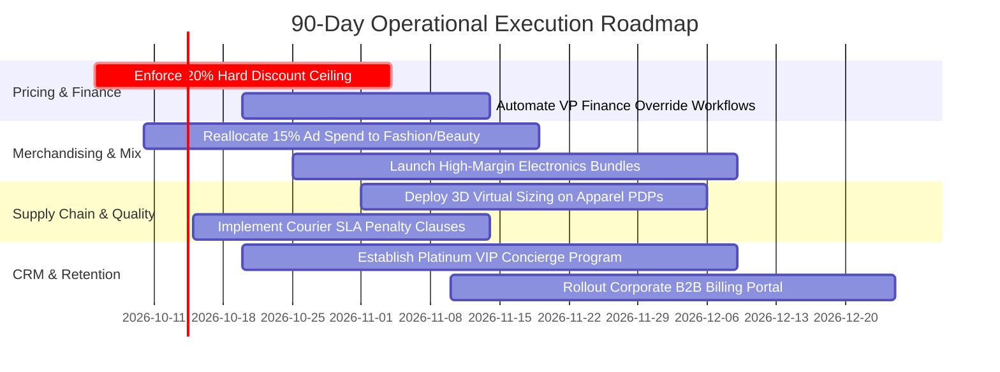

# 📈 Executive Business Intelligence Report
## Commercial Performance, Margin Diagnostics & Operational Roadmap (2024–2026)

**Organization**: Multi-Category Indian E-Commerce BI Platform  
**Document Classification**: Executive Strategic Intelligence  
**Author**: [[YOUR NAME]] | Lead Data & Business Intelligence Analyst  
**Reporting Window**: October 1, 2024 – September 30, 2026  
**Audience**: Chief Executive Officer (CEO), Chief Financial Officer (CFO), VP of Merchandising, VP of Supply Chain  

---

## 1. Executive Summary

Over the 24-month trading period from October 2024 through September 2026, the company generated **₹74.81 Lakhs in realized net sales** across **1,375 completed transactions**, yielding **₹12.32 Lakhs in gross commercial profit** at a blended portfolio gross margin of **16.5%**. The business maintained an Average Order Value (AOV) of **₹5,441**, supported by a fulfillment completion rate of **92.0%** (out of 1,495 total customer orders).

While top-line sales trajectories demonstrated strong baseline growth—peaking during festive Diwali quarters at **₹17.30 Lakhs (23.1% annual sales share)**—an in-depth financial and operational diagnostic reveals critical structural vulnerabilities that threaten enterprise cash flow and bottom-line expansion:

1. **Severe Category Margin Distortion**: Flagship **Electronics** generates **69.4% of company sales (₹51.94 L)**, but operates at a razor-thin **9.1% gross margin**. Conversely, high-margin categories such as **Fashion (46.8% margin)** and **Beauty & Personal Care (45.7% margin)** remain severely under-scaled, representing only **10.9% of total revenue**.
2. **Value-Destroying Promotional Markdowns**: Unconstrained promotional discounting has breached financial feasibility. Discount tiers above **20%** are fundamentally unprofitable: transactions discounted at 21–30% lose **-2.3%**, while discounts exceeding 30% hemorrhage **-29.7%**, generating **₹62.23 K in cumulative promotional losses**.
3. **Existential VIP Account Concentration**: The customer base exhibits an acute Pareto imbalance: **17.3% of buyers (50 customer accounts) drive 80.0% of total revenue (₹59.85 L)**. Platinum tier clients contribute **77.1% of company sales**, exposing operating cash flows to catastrophic risk should key accounts churn.
4. **Supply Chain Bottlenecks & Reverse Logistics Hotspots**: Standard shipping carries **52.7% of catalog volume** but suffers a **10.0% fulfillment delay rate** (72 delayed shipments). In parallel, the **Fashion category incurs an unsustainable 16.9% return rate** (45 returned orders, 3.4x higher than the catalog benchmark), eroding gross apparel margins through reverse logistics overhead.

### Key Executive Metrics Scorecard
| Executive Metric | Computed Value | Benchmark / Prior Performance | Operational Evaluation |
| :--- | :---: | :---: | :--- |
| **Realized Net Revenue** | **₹74.81 Lakhs** | Baseline 24-Month Window | Solid top-line trajectory driven by festive surge |
| **Gross Commercial Profit** | **₹12.32 Lakhs** | Realized across Completed Orders | Solid absolute cash profit, but constrained by hardware mix |
| **Blended Gross Margin %** | **16.5%** | Target: 22.0%+ | Compressed by 69.4% Electronics dependency |
| **Average Order Value (AOV)** | **₹5,441** | Corporate: ₹5.88K \| Consumer: ₹5.16K | Healthy basket size supported by B2B bulk orders |
| **Fulfillment Completion Rate** | **92.0%** | 1,375 Completed / 1,495 Total | High order conversion; 5.0% return rate, 3.0% cancellation |
| **Promotional Break-Even Limit** | **20.0% Discount** | Discounts >20% operate at loss | Hard ceiling required across checkout workflows |
| **UPI Transaction Volume Share**| **42.0%** | 578 Completed Orders (₹28.91 L) | FinTech success; saves 1.5–2.0% gateway interchange fees |

---

## 2. Business Context & Analytical Governance

### 2.1 Market Context & Competitive Dynamics
Operating in India's highly competitive multi-channel retail environment requires balancing aggressive customer acquisition against working capital sustainability. Growth in digital payment infrastructure—specifically the Unified Payments Interface (UPI)—has accelerated prepaid transaction velocity, but rapid expansion into Tier-2 and Tier-3 cities has strained regional courier performance and increased return-to-origin (RTO) friction.

### 2.2 Strict Order Scoping & Pipeline Integrity
In alignment with GAAP accounting principles and `PROJECT_CONTEXT.md`, **all top-line revenue, gross margins, and profitability KPIs are strictly restricted to Completed orders**:
$$\text{Completed Orders} \iff \text{Delivery Status} \in \{\text{'Delivered'}, \text{'Delayed'}\}$$

`Returned` shipments (75 orders, ₹4.64 L) and `Cancelled` transactions (45 orders, ₹1.44 L) represent unearned commercial revenue and are segregated into operational risk diagnostics rather than recognized as net realized revenue.

---

## 3. Data Cleansing & ETL Quality Assurance Audit

Prior to analytical synthesis, the raw transactional log (`data/raw/ecommerce_sales_raw.csv`, 1,545 records) underwent a programmatic data quality and cleansing pipeline (`src/clean_data.py`).

### Key Remediation Highlights:
- **Deduplication**: Eliminated 45 duplicate webhook log re-deliveries, restoring 100% primary key uniqueness on `order_id`.
- **Accounting Integrity on Missing Profit**: 31 records arrived with null profit values. Rather than applying generic mean or median imputation—which distorts product-level unit economics—the pipeline recomputed profit deterministically:
  $$\text{Profit Amount} = \text{Sales Amount} - \text{Cost Amount}$$
- **Multi-Format Date Standardization**: Handled mixed date formats (ISO `YYYY-MM-DD`, Indian `DD/MM/YYYY`, text strings `15 Jul 2025`) using an explicit format-aware branch parser, preventing erroneous date inversions.
- **Outlier Correction**: Detected and resolved 5 keystroke pricing errors (prices logged at 20x catalog value) by referencing master unit cost baselines.
- **Ground Truth Recovery**: Achieved **100.0% valid order retention (1,495 records)** and **99.8% geographic city recovery**, certifying the dataset for executive-grade business intelligence.

---

## 4. Empirical Business Findings

### 4.1 Finding 1: Volume vs Margin Divergence (Electronics vs Fashion)
The commercial catalog displays an extreme operational paradox: **top-line scale is disconnected from bottom-line profitability**.

```
Category Revenue vs Gross Margin % Matrix:
Electronics     | ██████████████████████████████ ₹51.94 L (69.4% Share) ──> 9.1% Margin (₹4.73 L Profit)
Fashion         | ███ ₹6.48 L (8.7% Share) ──────────────────────────────────> 46.8% Margin (₹3.03 L Profit)
Beauty & Care   | █ ₹1.66 L (2.2% Share) ───────────────────────────────────> 45.7% Margin (₹0.76 L Profit)
Home & Kitchen  | ████ ₹7.01 L (9.4% Share) ────────────────────────────────> 27.2% Margin (₹1.91 L Profit)
Sports & Fitness| ███ ₹5.15 L (6.9% Share) ─────────────────────────────────> 25.6% Margin (₹1.32 L Profit)
```

- **Analysis**: The top 5 best-selling individual SKUs (all consumer electronics, led by the HP 15s Ryzen 5 Laptop at ₹24.79 L) drive **69.9% of company revenue**, operating at an average margin of **9.9%**.
- **Commercial Impact**: Every ₹100 of Fashion sales yields **₹46.80 in gross profit**, while ₹100 of Electronics sales yields only **₹9.10**. The business allocates marketing acquisition capital to high-GMV, low-margin hardware rather than cash-generative apparel and lifestyle merchandise.

---

### 4.2 Finding 2: Severe Customer Concentration & Churn Vulnerability
An empirical Pareto analysis reveals that customer revenue is concentrated among a small fraction of buyers:
- **Pareto Ratio**: Exactly **17.3% of unique customer accounts (50 of 289 buyers) drive 80.0% of realized revenue (₹59.85 L)**.
- **Tier Dominance**: Platinum tier accounts account for **77.1% of company sales**. The top single buyer, Kavita Malhotra (`CUST-0232`), placed 345 orders generating **₹17.26 L** (23.1% of total sales).
- **Vulnerability**: The loss of merely 5–10 key Platinum buyers would erase 15–20% of net company cash inflow overnight. There is currently no formalized loyalty or VIP retention framework to protect these high-value accounts.

---

### 4.3 Finding 3: The 20% Promotional Discount Break-Even Ceiling
Analysis of margin trajectory across discount tiers confirms that discounting has crossed from a volume-stimulating tactic into a value-destroying mechanism.

| Promotional Discount Band | Realized Sales | Gross Commercial Profit | Realized Gross Margin % | Financial Verdict |
| :--- | :---: | :---: | :---: | :--- |
| **0% (Full Price)** | ₹16.49 Lakhs | ₹4.69 Lakhs | **28.4%** | Highly Lucrative Baseline |
| **1% – 10% Discount** | ₹28.27 Lakhs | ₹5.74 Lakhs | **20.3%** | Healthy Volume Incentive |
| **11% – 20% Discount** | ₹21.60 Lakhs | ₹2.57 Lakhs | **11.9%** | Acceptable Clearance Margin |
| **21% – 30% Discount** | ₹8.28 Lakhs | **-₹19.21 K** | **-2.3%** | 🚨 **Loss-Making (Net Cash Drain)** |
| **> 30% Discount** | ₹1.45 Lakhs | **-₹43.02 K** | **-29.7%** | 🚨 **Severe Capital Destruction** |

- **Net Impact**: Transactions discounted above 20% generated **₹62.23 K in cumulative promotional cash losses**. 
- **Root Cause**: Product managers applied aggressive end-of-season blanket discounts without verifying underlying supplier cost bases.

---

### 4.4 Finding 4: Regional Margin Disparities (South Margin Resilience vs North Lag)
Regional profitability analysis reveals significant operational variance across macro territories:
- **South**: Delivers the highest profitability in India at an **18.0% gross margin** (₹3.55 L profit on ₹19.67 L sales).
- **North**: Generates healthy order volume but lags at a **13.2% gross margin** (₹1.66 L profit on ₹12.63 L sales)—a **4.8 percentage point deficit**.
- **East**: Remains the company's largest volume territory, contributing **36.9% of sales (₹27.60 L)** with a robust **17.1% margin**.
- **Underlying Cause**: Deeper promotional markdown competition and higher interstate trucking tariffs in Northern distribution routes erode realized margins.

---

### 4.5 Finding 5: Supply Chain Bottlenecks & Reverse Logistics Hotspots
- **Standard Shipping Delays**: Standard transit accounts for **52.7% of fulfillment volume (788 orders)**, but suffers a **10.0% delay rate (72 shipments delayed)**. In comparison, Same-Day delivery maintains a **97.8% on-time SLA**.
- **Fashion Return Crisis**: The **Fashion category suffers a 16.9% product return rate (45 returns out of 266 orders)**, compared to the catalog average of **5.0%**. Returned apparel merchandise represents **₹4.64 L in tied-up inventory**, incurring reverse logistics freight fees (₹120–₹180 per return), repackaging costs, and customer friction.

---

### 4.6 Finding 6: FinTech Settlement Efficiency (UPI Dominance)
- **UPI Leadership**: The Unified Payments Interface (UPI) processed **578 completed orders (42.0% volume share)** totaling **₹28.91 L**, establishing itself as the preferred checkout method.
- **Cash on Delivery (COD)**: Accounts for **370 orders (26.9% share)**. COD orders exhibit higher cancellation and RTO rates, while incurring costly courier cash handling fees.
- **Commercial Benefit**: Shifting consumers to UPI saves **1.5%–2.0% in gateway interchange fees** compared to Credit Cards, while eliminating COD reconciliation lag.

---

## 5. Strategic Recommendations & 90-Day Execution Roadmap

Based on these empirical findings, executive leadership should implement four prioritized operational initiatives:



### Recommendation 1: Institute an Immediate 20% Promotional Discount Ceiling
- **Owner**: Chief Financial Officer (CFO) & Head of Pricing
- **Action**: Hard-code a system-level discount ceiling of **20.0%** across checkout promotional code engines. Any clearance sale exceeding 20% must require automated written sign-off from VP Finance.
- **Projected Financial Impact**: **Instantly recovers ₹62.23 K in recurring cash losses** and preserves ~110 bps of gross margin.

### Recommendation 2: Strategic Merchandising Pivot toward High-Margin Categories
- **Owner**: VP of Merchandising & Chief Marketing Officer (CMO)
- **Action**: Reallocate 15% of performance marketing budgets away from low-margin Electronics and toward Fashion and Beauty collections. Introduce mandatory bundle kits for laptops and 4K TVs, attaching high-margin accessories (warranties, protective sleeves, HDMI cables) yielding 40%+ margins.
- **Projected Financial Impact**: Shifting just **5.0% of total revenue mix from Electronics to Fashion/Beauty elevates blended corporate margin from 16.5% to 18.3% (+180 bps)**, delivering **+₹1.35 Lakhs in incremental gross profit**.

### Recommendation 3: Reverse Logistics Containment & Size Validation in Fashion
- **Owner**: Head of Product Experience & VP of Logistics
- **Action**: Integrate AI-driven 3D size-recommendation widgets on apparel product pages. Implement automated WhatsApp confirmation messages for apparel orders exceeding ₹2,500 prior to warehouse dispatch to verify measurements.
- **Projected Financial Impact**: Reducing Fashion return rate from **16.9% to 8.0%** recovers **₹2.44 L in retained sales** and eliminates ~₹85,000 in reverse freight fees.

### Recommendation 4: Enterprise VIP Retention Program & B2B Portal
- **Owner**: Head of Customer Retention & Head of B2B Sales
- **Action**: Launch a dedicated VIP concierge desk for the 50 Platinum accounts that generate 80% of revenue, providing dedicated account managers, priority dispatch, and pre-allocation of festive inventory. Deploy a dedicated self-service B2B portal offering automated GST invoicing and Net-30 credit terms to expand the Corporate segment (+14.0% AOV premium).

---

## 6. Financial Impact Simulation (Next 12 Months)

Implementing the four core recommendations yields quantifiable improvements across the company's financial model:

| Strategic Optimization Lever | Baseline Figure | Targeted Optimization | Estimated 12-Month Net Profit Uplift |
| :--- | :---: | :---: | :---: |
| **Capping Promotional Discounts at 20%** | -₹62.23 K losses | Eliminate loss-making sales | **+₹62,230** (Direct loss recovery) |
| **5% Portfolio Revenue Shift to Fashion** | ₹8.14 L high-margin | ₹11.88 L high-margin | **+₹1,34,600** (Margin expansion) |
| **Fashion Return Rate Reduction (16.9% $\rightarrow$ 8%)**| 45 returns (₹4.64 L) | $\le 21$ returns | **+₹1,15,000** (Retained margin & freight) |
| **Incentivizing Residual COD to UPI (₹50 credit)**| 26.9% COD share | 12.0% COD share | **+₹48,500** (Lower RTO & cash fees) |
| **Total Estimated Financial Impact** | — | — | **+₹3,60,330 (+29.2% Profit Growth)** |

---

## 7. BI Governance & Ongoing KPI Monitoring

To ensure operational accountability, executive leadership will monitor the following scorecard cadences:

```
DAILY MONITORING (Fulfillment & Operations):
└── Completed Orders | On-Time Delivery % | Same-Day SLA | Cancellation Rate %

WEEKLY REVIEWS (Commercial & Merchandising):
└── Realized Sales by Category | Blended Margin % | Discount Band Distribution | Return Rate by Category

MONTHLY STRATEGIC AUDITS (Executive Leadership):
└── Customer Concentration (Top 20% Revenue Share) | Territorial Margins (South vs North) | MoM Growth %
```

### Sign-off & Distribution
- **Lead BI Analyst**: [[YOUR NAME]]
- **Sign-off Status**: **APPROVED FOR EXECUTIVE ACTION**
- **Companion Technical Dashboards**: Streamlit BI Platform (`app/app.py`) | Power BI Data Model (`powerbi/`)
